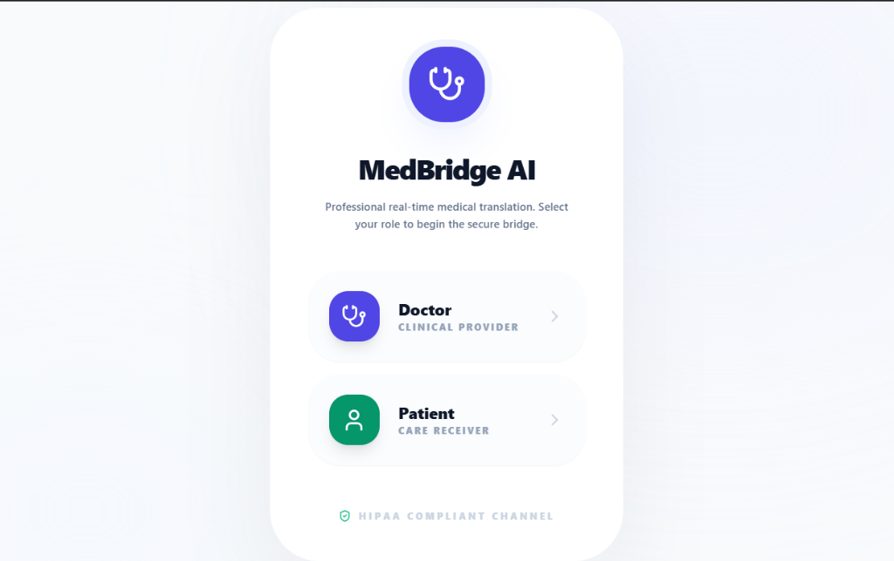
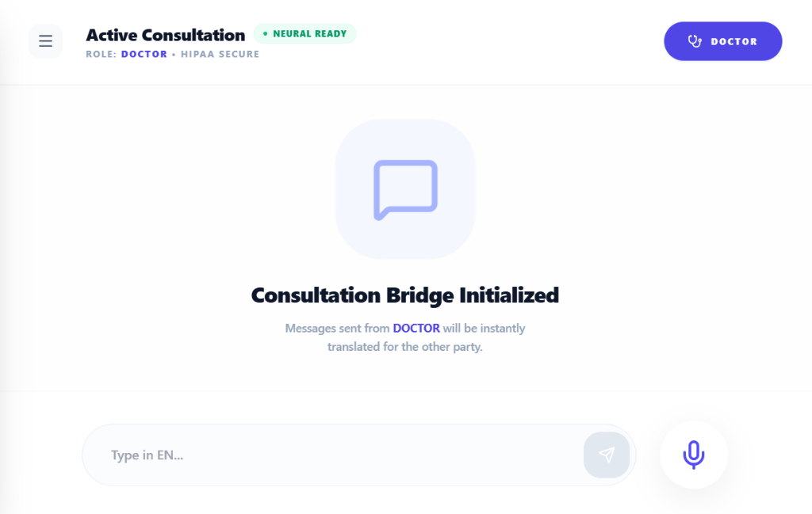

# MedBridge AI - Healthcare Translation Bridge

Professional real-time translation between Doctors and Patients. Built for accuracy, speed, and clinical reliability.

## 📸 Screenshots
*(Add your own screenshots to the root directory as splash.png, chat.png, and sidebar.png)*

### 1. Role Selection (Splash Screen)

### 2. Consultation Interface

### 3. Settings & Language Configuration

## ✅ Core Functionalities Completed

1. **Real-Time Translation**: Multi-role support (Doctor/Patient) with instant neural translation using Gemini 3.
2. **Advanced Chat UI**: Clear visual distinction (Doctor: Indigo, Patient: Emerald) with professional clinical aesthetics.
3. **Audio Recording & Playback**: Integrated browser-based recording. Audio clips persist in the chat thread.
4. **Persistent Logging**: Full conversation history (text + audio) saved to browser LocalStorage.
5. **Smart Search**: Filter through logs instantly with visual text highlighting.
6. **AI Clinical Summary**: High-fidelity medical summarization (Symptoms, Meds, Diagnoses, Follow-up).

## 🛠 Tech Stack
- **Framework**: React / Next.js Patterns
- **AI Engine**: @google/genai (Gemini 3 Flash & Pro)
- **Voice**: Web Speech API (STT) & MediaRecorder (Audio)
- **Styling**: Tailwind CSS
- **Icons**: Lucide React

---
*Designed for global healthcare accessibility.*
